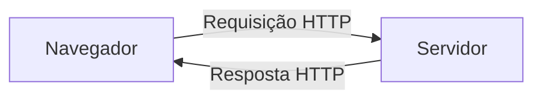

**2025-02-17 19:14**

**Sprint:** [[Sprint7]]

**Topic:** #extraindo-dados-online 

**Connections:** 

---
# **Protocolos de Transferência**
## Fundamentos da Comunicação Web

### O que são Protocolos de Transferência?
Um protocolo de transferência é um conjunto de regras que governa como computadores trocam informações através da internet. 

> "A troca de dados na internet é baseada no princípio de 'requisição-resposta': um navegador gera uma requisição, então o servidor analisa-a e envia uma resposta."

### Analogia com Sistema Postal
Para entender melhor o conceito, podemos fazer uma analogia com o sistema postal:

| Sistema Postal | Protocolo HTTP |
|----------------|----------------|
| Envelope | Estrutura da requisição |
| Endereço do destinatário | URL do servidor |
| Regras de endereçamento | Formato do protocolo |
| Selo postal | Cabeçalhos HTTP |
| Conteúdo da carta | Corpo da requisição/resposta |

## HTTP vs HTTPS

### HTTP (Hypertext Transfer Protocol)
- Protocolo original para transferência de dados na web
- Inicialmente desenvolvido para documentos HTML
- Atualmente usado para todos os tipos de dados

### HTTPS (HTTP Secure)
- Versão segura do HTTP
- **Características principais:**
  - Criptografia de dados
  - Proteção contra interceptação
  - Padrão atual para sites seguros
  - Adotado por bancos e redes sociais

*Nota de Segurança:* Navegadores modernos alertam sobre sites que ainda usam HTTP simples.

## Anatomia da Comunicação Web

### Estrutura da Requisição
7. **Método HTTP**
   - GET: solicita dados
   - POST: envia dados
   - *Outros métodos disponíveis*

8. **Componentes Principais**
   - Caminho (exemplo: */hello* em *example.com/hello*)
   - Versão do HTTP
   - Cabeçalhos de requisição
   - Corpo da requisição (opcional)


### Estrutura da Resposta
9. **Elementos Básicos**
   - Versão do HTTP
   - Código de status e mensagem
   - Cabeçalhos de resposta
   - Corpo da resposta


1. **Códigos de Status Comuns**
   ```
   200 OK - Sucesso
   404 Not Found - Recurso não encontrado
   ```

## Fluxo de Comunicação



### Exemplo Prático
Para um site como *example.com/hello*:
2. Navegador envia requisição
3. Servidor processa requisição
4. Servidor retorna resposta
5. Navegador renderiza conteúdo

# Resumo Geral

**Pontos-Chave:**
- Protocolos são essenciais para padronizar a comunicação na web
- HTTPS é o padrão atual para comunicação segura
- Requisições e respostas seguem estruturas bem definidas
- A comunicação web é baseada no modelo requisição-resposta

*Considerações Práticas:*
- Sempre priorize HTTPS para proteger dados dos usuários
- Entenda os diferentes métodos HTTP para uso apropriado
- Observe os códigos de status para diagnóstico de problemas
- Mantenha-se atualizado com as melhores práticas de segurança

> "O entendimento dos protocolos de transferência é fundamental para o desenvolvimento web moderno e seguro."


